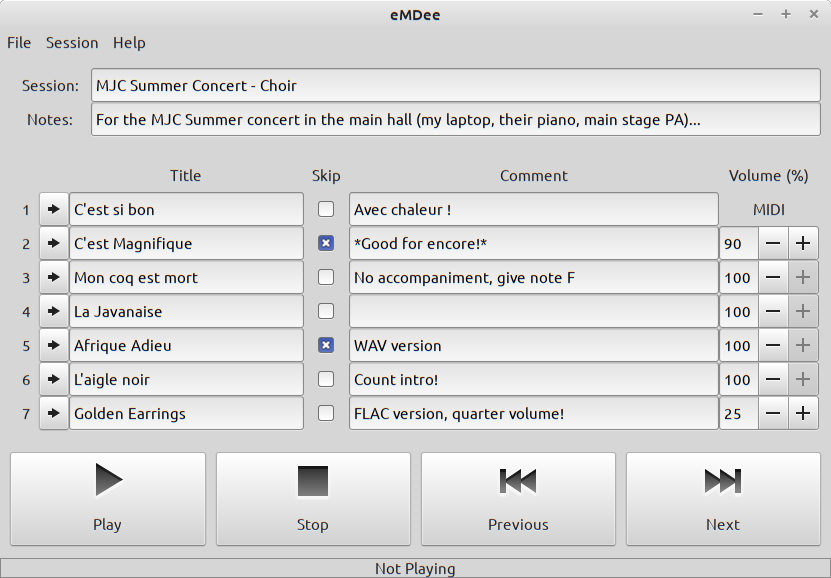
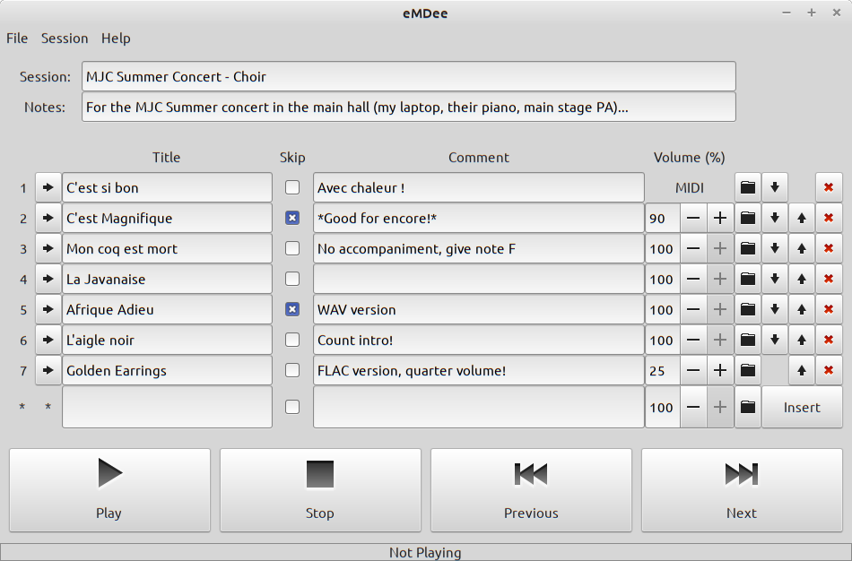

<a href="https://github.com/SMerrony/emdee">
    
</a>

# eMDee Musical Director's Assistant

  


`eMDee` is a live performance and rehearsal assistant for musical directors which removes 
the need to have folders of tracks and command-line windows open in order to play backing tracks for performance groups such as singers, choirs, and theatre-groups.

The MD can plan in advance the order of performance; later, `eMDee` will facilitate the playing of each track in the specfied order during the performance.



`eMDee` was originally designed for GNU Linux systems such as Mint, Debian, Ubuntu, etc., 
it now also runs under Windows.

- [eMDee Musical Director's Assistant](#emdee-musical-directors-assistant)
  - [Core Features](#core-features)
  - [Session Editing](#session-editing)
  - [Prerequisites](#prerequisites)
    - [GNU/Linux](#gnulinux)
    - [Windows](#windows)
  - [Installation](#installation)
    - [Install Executable](#install-executable)
      - [GNU/Linux](#gnulinux-1)
      - [Windows](#windows-1)
    - [Build from Source](#build-from-source)
      - [From the Alire Crate Repository](#from-the-alire-crate-repository)
      - [From Source Download](#from-source-download)

## Core Features
* Create 'session' of 'tracks'
* Tracks may be audio (FLAC, MP3, OGG, WAV) or MIDI files (played externally)
* Tracks may be re-ordered
* Tracks may be marked for skipping in performance
* Controls are provided to Play, Stop
* Audio tracks may have a volume modified
* Dummy or 'placeholder' tracks may be inserted to remind MD of a cappella pieces etc.
* Independently scalable interface, so you can have a nice big font for live use without reconfiguring your desktop

Third-party 'helper' applications are used to actually play the tracks, currently...
* `ffplay` for FLAC, MP3, OGG and WAV
* `aplaymidi` (Linux) or `playsmf` (Windows) for MIDI files on an external device such as a synthesizer, keyboard, organ, or digital piano

You must ensure those applications are installed on your system for `eMDee` to work, see below.

When a MIDI file is manually stopped from playing, an all-notes-off MIDI file is sent to the player to prevent stuck notes.

## Session Editing



## Prerequisites
`eMDee` relies on well-known third-party applications to play audio and MIDI files, these must be installed
for `eMDee` to function.

### GNU/Linux
1. `ffplay` is part of the `ffmpeg` package on most systems derived from Debian (eg. Mint, Ubuntu).  It should be installed via your usual package manager.
2. `aplaymidi` is part of the `alsa-utils` package on most systems derived from Debian (eg. Mint, Ubuntu).  It should be installed via your usual package manager.

### Windows
1. `ffplay` is a part of the `ffmpeg` package.  A Windows binary is available at https://www.gyan.dev/ffmpeg/builds/#release-builds, you only need the `essentials` build for `eMDee`.  If you are unsure how to install, see https://www.wikihow.com/Install-FFmpeg-on-Windows.
2. `playsmf` is part of "Div's MIDI Utilities" available here: http://public.sreal.com/~div/midi-utilities/.

You will neeed to ensure that both of these players are on your PATH so that `eMDee` can find them.  There are clear instructions in the above FFmpeg installation guide on how to do this, follow the same steps for `playsmf`.

## Installation

### Install Executable
#### GNU/Linux
An AppImage file will normally be provided with each release.  Install it in the usual manner.

#### Windows
TODO

### Build from Source

`eMDee` is written in Ada and built using the modern `Alire` source-based package manager.
This is easy to install under Linux or Windows and handles the entire build-chain for you.
See https://alire.ada.dev/docs/ for how to install `Alire` on your system.

#### From the Alire Crate Repository
[Not yet published]

Once `Alire` is installed, the following command will download and build `eMDee` and its internal dependencies in one step...
```
alr get --build emdee
```
#### From Source Download
Download and extract the latest release source code bundle from https://github.com/SMerrony/emdee/releases

In the newly-created directory run `alr build`.  The first time you do this it may take some minutes whilst all
the required libraries are downloaded and built, subsequent builds will be very fast.

The executable will be found in the `bin` subdirectory.
