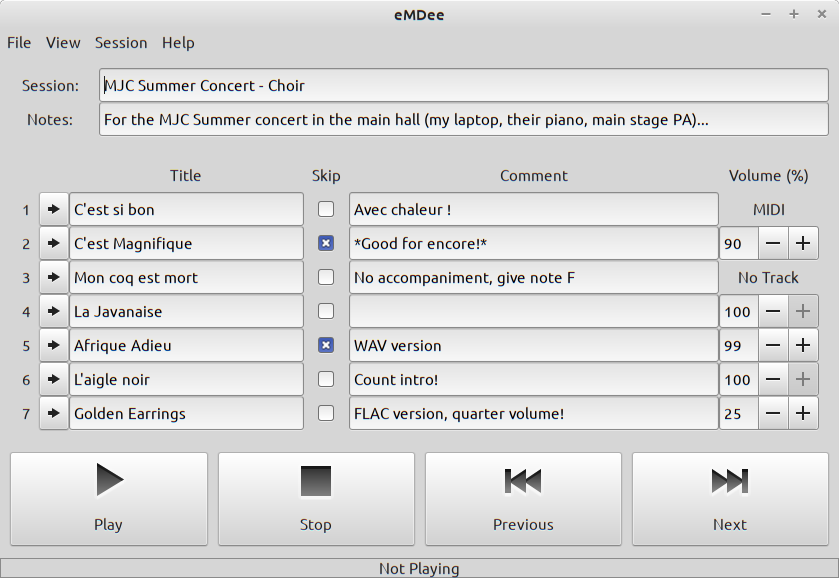
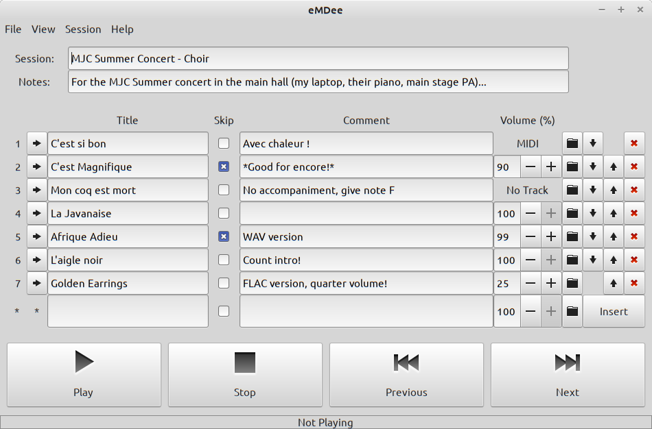

# eMDee Musical Director's Assistant

  

`eMDee` is a live performance assistant for musical directors which removes 
the need to have folders of tracks and command-line windows open in order to play backing tracks for performance groups such as singers, choirs, and theatre-groups.

The MD can plan in advance the order of performance; later, `eMDee` will facilitate the playing of each track in the specfied order during the performance.

Additional controls may be added to specific tracks such as changing the volume level.

`eMDee` is designed for, and probably only runs on, GNU Linux systems such as Mint, Debian, Ubuntu, etc.

## Core Features
* Create 'session' of 'tracks'
* Tracks may be audio (FLAC, MP3, OGG, WAV) or MIDI files
* Tracks may be re-ordered
* Tracks may be marked for skipping in performance
* Controls are provided to Play, Stop
* Audio tracks may have a volume modifie
* Dummy or 'placeholder' tracks may be inserted to remind MD of a cappella pieces etc.

Third-party 'helper' applications are used to actually play the tracks, currently...
* `ffplay` for FLAC, MP3, OGG and WAV
* `aplaymidi` for MIDI files on an external device such as a synthesizer, keyboard, or digital piano

You must ensure those applications are installed on your system for `eMDee` to work.

When a MIDI file is manually stopped from playing, an all-notes-off MIDI file is sent to the player to prevent stuck notes.

## Session Editing

